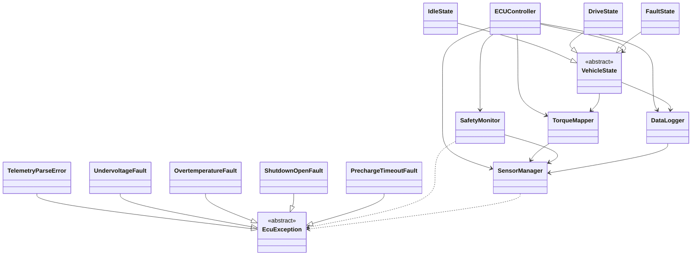

## Cartões CRC: Modelagem da ECU

### 1. Classe: `ECUController`
* **Superclasse:** —
* **Módulo/Namespace:** `ecu::core`
* **Responsabilidades:**
  * Inicializar todos os subsistemas da simulação.
  * Conhecer o estado atual do veículo na Máquina de Estados Finitos (FSM).
  * Executar o loop principal (*Main Loop*) de atualização contínua.
  * Delegar o cálculo final de torque requisitado para a classe mapeadora.
  * Forçar a transição para o estado de *Fault* caso receba sinal de abertura do *Shutdown System*.
* **Colaborações:** `VehicleState`, `SensorManager`, `SafetyMonitor`, `TorqueMapper`, `DataLogger`.

### 2. Classe: `VehicleState`
* **Superclasse:** — (classe base abstrata)
* **Módulo/Namespace:** `ecu::state`
* **Responsabilidades:**
  * Definir a interface padrão para os estados do carro (*Idle*, *Drive*, *Fault*).
  * Conhecer as regras de transição permitidas a partir do estado momentâneo atual.
  * Bloquear a tentativa de troca de mapas de motor se o veículo estiver no estado desligado/inativo.
  * Validar se o input do pedal deve ser processado ou ignorado no estado atual.
  * Executar rotinas de configuração ao entrar e sair de cada estado.
* **Colaborações:** `ECUController`, `TorqueMapper`, `DataLogger`.

### 3. Classe: `TorqueMapper`
* **Superclasse:** —
* **Módulo/Namespace:** `ecu::control`
* **Responsabilidades:**
  * Conhecer qual a tabela de mapeamento atual (Eco, MidTerm ou Sport) está selecionada.
  * Receber a porcentagem bruta do pedal do acelerador lida pelos sensores.
  * Calcular a interpolação linear entre os pontos da tabela para encontrar o torque exato.
  * Aplicar o algoritmo de rampa (*ramping*) otimizado para o limite de tração mecânica.
  * Limitar a requisição de torque final ao teto máximo de segurança do motor.
* **Colaborações:** `SensorManager`, `VehicleState`, `ECUController`.

### 4. Classe: `SensorManager`
* **Superclasse:** —
* **Módulo/Namespace:** `ecu::io`
* **Responsabilidades:**
  * Conhecer o caminho e o nome do arquivo CSV de entrada para a simulação.
  * Abrir, ler e validar os dados de telemetria simulada, pulando falhas de formatação.
  * Conhecer e fornecer a posição momentânea do pedal do acelerador.
  * Conhecer e fornecer as temperaturas do motor e bateria, além da pressão do freio e tensão geral.
  * Avançar a leitura para a próxima linha (próximo *tick* de tempo da simulação).
* **Colaborações:** `ECUController`, `SafetyMonitor`, `TorqueMapper`, `DataLogger`.

### 5. Classe: `SafetyMonitor`
* **Superclasse:** —
* **Módulo/Namespace:** `ecu::safety`
* **Responsabilidades:**
  * Validar continuamente se o *Shutdown System* encontra-se fechado e operacional.
  * Monitorar a tensão da bateria, acionando falha se cair abaixo de 60V.
  * Ler a pressão de freio para validar condições de segurança estipuladas.
  * Emitir alertas (*Warnings*) aos 60°C e disparar gatilho de falha crítica aos 80°C no motor/baterias.
  * Monitorar o *timeout* da sequência de pré-carga, impedindo a transição para tração em caso de falha.
* **Colaborações:** `SensorManager`, `ECUController`.

### 6. Classe: `DataLogger`
* **Superclasse:** —
* **Módulo/Namespace:** `ecu::io`
* **Responsabilidades:**
  * Conhecer o diretório e o nome do arquivo de saída de telemetria do sistema (`.txt`).
  * Gravar as variáveis contínuas (pedal, torque, temperatura) anexando o *timestamp* do ciclo.
  * Registrar a troca entre os modos Eco, MidTerm e Sport com precisão de tempo.
  * Registrar os eventos de erro crítico, alertas termais ou abertura inesperada do *Shutdown System*.
  * Garantir o salvamento físico dos dados no disco mesmo em caso de travamento do controlador.
* **Colaborações:** `ECUController`, `SensorManager`, `VehicleState`.

### 7. Classe: `IdleState`
* **Superclasse:** `VehicleState`
* **Módulo/Namespace:** `ecu::state`
* **Responsabilidades:**
  * Manter o veículo em pronto-sem-tração, ignorando o input do pedal do acelerador.
  * Bloquear a troca dos mapas Eco/MidTerm/Sport enquanto ativo.
  * Autorizar a transição para `DriveState` apenas quando o `SafetyMonitor` confirmar pré-carga concluída dentro do *timeout*.
* **Colaborações:** `ECUController`, `SafetyMonitor`, `TorqueMapper`.

### 8. Classe: `DriveState`
* **Superclasse:** `VehicleState`
* **Módulo/Namespace:** `ecu::state`
* **Responsabilidades:**
  * Processar o input do pedal e encaminhá-lo ao `TorqueMapper`.
  * Autorizar a troca dinâmica de mapas Eco/MidTerm/Sport durante a condução.
  * Transitar para `FaultState` sob qualquer sinalização crítica emitida pelo `SafetyMonitor`.
* **Colaborações:** `ECUController`, `TorqueMapper`, `SafetyMonitor`, `DataLogger`.

### 9. Classe: `FaultState`
* **Superclasse:** `VehicleState`
* **Módulo/Namespace:** `ecu::state`
* **Responsabilidades:**
  * Ignorar por completo o input do pedal do acelerador.
  * Zerar a requisição de torque enviada ao `TorqueMapper`.
  * Manter registro contínuo do motivo da falha via `DataLogger` até o encerramento da simulação.
* **Colaborações:** `ECUController`, `TorqueMapper`, `DataLogger`.

### 10. Classe: `EcuException` (hierarquia de exceções)
* **Superclasse:** `std::exception`
* **Módulo/Namespace:** `ecu::exceptions`
* **Responsabilidades:**
  * Servir como classe base para todas as falhas específicas do simulador, expondo mensagem via `what()`.
  * `TelemetryParseError` — sinalizar linhas do CSV que não puderam ser interpretadas pelo `SensorManager`.
  * `UndervoltageFault` — sinalizar leitura de tensão da bateria abaixo de 60V.
  * `OvertemperatureFault` — sinalizar temperatura crítica (>= 80°C) em motor ou bateria.
  * `ShutdownOpenFault` — sinalizar abertura do *Shutdown System*.
  * `PrechargeTimeoutFault` — sinalizar estouro do *timeout* da sequência de pré-carga.
* **Colaborações:** `SensorManager`, `SafetyMonitor`, `ECUController`.

---

## Diagrama de classes (Mermaid)

